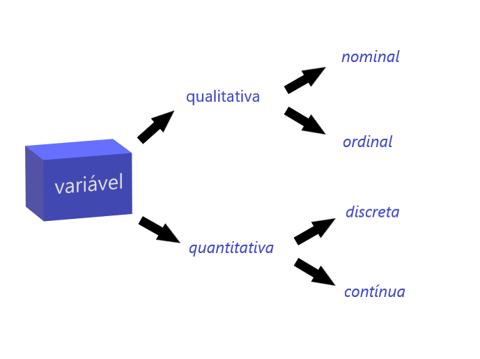

<br>
<font size=4> 
Texto de referência: [Estatística Básica][1] - *Wilton de O. Bussab & Pedro A. Morettin*  
<br>
A ***Análise Exploratória de Dados (AED)*** visa obter dos dados a maior quantidade possível de informação, que indique modelos plausíveis a serem utilizados numa fase posterior, a análise confirmatória de dados (ou *inferência estatística*[^1]) .  
<br>
Fundamentalmente, quando se procede a uma análise de dados, busca-se alguma forma de regularidade ou padrão ou, ainda, modelo, presente nas observações.
 
---

## Resumo de Dados

***

### Tipos de Variáveis [^2]

<center>
{#id .class width=50% height=50%}</center>
<br>
Queremos conhecer o *comportamento* de uma variável, analisando a ocorrência de suas possíveis realizações.   

---

## *Distribuição de Frequências*  
<br>
Usaremos a notação $n_i$ para indicar a frequência (absoluta) de cada classe, ou categoria, de uma variável, e a notação $f_i=n_i/n$ para indicar a proporção (ou frequência relativa) de cada classe, sendo $n$ o nº total de observações.  
<br>
O **histograma** é um gráfico de barras contíguas, com bases proporconais aos intervalos das classes e a área de cada retângulo proporcional à respectiva frequência. Pode-se usar tanto a frequência absoluta, $n_i$, como a relativa, $f_i$. Indiquemos a amplitude do *i-ésimo* intervalo por $\Delta_i$. Para que a área do retângulo respectivo seja proporcional a $f_i$, a sua altura deve ser proporcional a $f_i/\Delta_i$ (ou a $n_i/\Delta_i$), que é a ***densidade de frequência*** da *i-ésima* classe. Com essa convenção, a área total do histograma será igual a 1.  
<br>
Quando os intervalos das classes forem todos iguais a $\Delta$, a densidade de frequência da *i-ésima* classe passa a ser $f_i/\Delta$ ou $n_i/\Delta$).  
<br>

---

### Exemplo 1.1 - *tipos de variáveis e distribuição de frequências*  

*Obs*.: o exemplo a seguir foi extraído diretamente do livro de referência; os dados e códigos base necessários para a reprodução dos exemplos originais do livro em liguagem R podem ser obtidos no [site do IME USP][2]. Este tutorial é apenas uma seleção de trechos do livro e faz algumas adaptações aos códigos originais. Os códigos deste tutorial estão disponíveis [aqui][3].  
<br>

```{r, echo=FALSE, cache=TRUE, warning=FALSE, message=FALSE, fig.align='center'}

  # Carrega dados dos exemplos do livro para o ambiente
  
    load(url(description = "https://www.ime.usp.br/~pam/dados.RData"))

  # Concertar problema de encoding em varíaveis qualitativas nominais

    tab2_1$grau_instrucao <- sub("ensino médio", "ensino médio", tab2_1$grau_instrucao)
    
    colnames(tab2_1) <- c("Nº",	"estado civil",	"grau de instrução",	"nº de filhos",
                          "salário",	"idade anos",	"idade meses",	"região de procedência")

  # Visualizar tabela

    library(knitr)
  
    kable(tab2_1[1:10,], 
          caption = "Tabela 1.1 - Informações dos empregados de uma companhia hipotética (apenas 10 primeiras linhas)",
          align = "c")
    
  # Sumário
    
    tab2_1_sm <- data.frame(unclass(summary(tab2_1$salário)), 
                     check.names = FALSE, 
                     stringsAsFactors = FALSE)
    
    colnames(tab2_1_sm) <- "salários"

    kable(tab2_1_sm,
          caption = "Tabela 1.2 - Sumário de salários da companhia",
          label = "",
          align = 'c')
    
  # Frequências e porcentagens
    
    ni <- table(tab2_1$`grau de instrução`) # Calcula a tabela de frequências absolutas 
    
    fi <- prop.table(ni) # Tabela de frequências relativas (f_i)
    
    p_fi <- 100 * prop.table(ni) # Porcentagem (100 * f_i)
    
  # Adiciona linhas de total
    
    ni <- c(ni,sum(ni)) 
    
    fi <- c(fi,sum(fi))
    
    p_fi <- c(p_fi, sum(p_fi))
    
    names(ni)[4] <- "Total"
    
    tab2_2 <- cbind(ni, fi = round(fi, digits=2), p_fi = round(p_fi, digits=2))
    
    colnames(tab2_2) <- c("Frequência $n_i$", "Proporção $f_i$", "Porcentagem $f_i$")
    
    kable(tab2_2,
          caption = "Tabela 1.3 - Frequências e porcentagens segundo grau de instrução",
          label = "",
          align = 'c')
    
  # Frequências por faixas
    
    ni <- table(cut(tab2_1$salário, 
                    breaks = seq(4, 24, by=4), right=FALSE)) # Frequências por categorias
    
    tab2_4 <- rbind(ni, p_fi = 100 * prop.table(ni)) # Frequencias relativas em %
    
    tab2_4 <- as.data.frame(
              t(cbind(tab2_4,
                      c(sum(tab2_4[1,]), sum(tab2_4[2,])))),
              row.names = c(colnames(tab2_4), "Total")) # Construção da tabela
    
    tab2_4 <- transform(tab2_4, p_fi = round(p_fi, digits = 2))
    
  # Adaptar para plotagem
   
    colnames(tab2_4) <- c("Frequência $n_i$","Porcentagem $f_i$")
     
    kable(tab2_4,
          caption = "Tabela 1.4 - Frequências e porcentagens por faixa salarial",
          label = "",
          align = 'c')
    
    
    fig27 <- hist(tab2_1$salário, 
                  breaks = seq(4, 24, by = 4), 
                  right = FALSE, 
                  probability = T, 
                  plot = F)
    
    aux <- with(fig27, 100 * density * diff(breaks)[1])
    
    labs <- paste(round(aux), "%", sep="")
    
    plot(fig27, 
         freq = FALSE, labels = labs, 
         ylab="Densidade de Frequência",
         xlab="Salário",
         col="grey",
         border="white",
         # labels=T,
         main="Figura 1.1: Histograma da variável (contínua) 'salários'",
         xlim=c(0,24), xaxp=c(0,24,6),
         ylim=c(0,.1))
    
    
      fig28<-hist(tab2_1$`nº de filhos`, right=F, breaks=seq(-.5,5.5,1),plot=F)
      
      aux<-with(fig28, 100 * density* diff(breaks)[1])
  
      labs <- paste(round(aux), "%", sep="")
  
      plot(fig28,
        ylab="Densidade de Frequência",
        xlab="Número de Filhos",
        col="grey",
        border="white",
        bty="n",yaxt="n",ylim=c(0,8),
        main="Figura 1.2: Histograma da variável (discreta) número de filhos",
        labels=labs)
```

---

## *Medidas-Resumo*

***

### *Medidas de Posição*

Podemos reduzir ainda mais os dados, apresentando um ou alguns valores que sejam ***representativos*** de toda a série. Usualmente, emprega-se uma das seguintes medidas de posição (ou localização) central: média, mediana ou moda.  
<br>
A ***moda*** é definida como a realização mais frequente do conjunto de valores observados. Em alguns casos, pode haver mais de uma moda, ou seja, a distribuição dos valores pode ser bimodal, trimodal etc. Para calcular a moda precisamos apenas da distribuição de frequências (contagem).   
<br>
A ***mediana*** é a realização que ocupa a posição central da série de observações, quando estão ordenadas em ordem crescente. Quando o nº de obs. for par, usa-se como mediana a média aritmética das duas observações centrais.  
<br>
A ***média aritmética*** é a soma das observações dividida pelo nº delas.  
<br>
Se $x_1, \  ..., x_n$ são os $n$ valores (distintos ou não) da variável $X$, a média aritmética, ou simplesmente média, de $X$ pode ser escrita  
<br>
$$\overline x= \frac{x_1+...+x_n}{n}=\frac{1}{n}\sum^n_{i=1}x_i \ \ \ \ \ \ \ \ \ \ \ \ \ \ \ \ \ \ \ \ (1.1)$$
<br>
Se tivermos $n$ observações da variável $X$, das quais $n_1$ são iguais a $x_1$, $n_2$ são iguais a $x_2$ etc., $n_k$ iguais a $x_k$, então a média de $X$ pode ser escrita
<br>
$$\overline x=\frac{n_1x_1+...+n_kx_k}{n}=\frac{1}{n}\sum^k_{i=1}n_ik_i \ \ \ \ \ \ \ \ \ \ \ \ \ \ \ \ \ \ \ \ (1.2)$$
<br>
Se $f_i=n_i/n$ representar a frequência relativa da observação $x_i$, então $(1.2)$ também pode ser escrita  
<br>
$$\overline x=\sum^k_{i=1}f_ix_i \ \ \ \ \ \ \ \ \ \ \ \ \ \ \ \ \ \ \ \  (1.3)$$
<br>
As observações quando ordenadas em ordem decrescente são chamadas ***estatísticas de ordem***. Caso ordenada, a ***mediana*** da variável X pode ser definida como  
<br>
$$md(X)=\begin{cases} x_{(\frac{n+1}{2})}, \ \ \ \text{se n ímpar;} \\\\ {\frac{x_{(\frac{n}{2})} \ + \ \ x_{({\frac{n}{2}+1})}}{2}}, \ \ \ \text{se n par.} \end{cases} \ \ \ \ \ \ \ \ \ \ \ \ \ \ \ \ \ \ \ \  (1.4)$$

***

### *Medidas de Dispersão*

Um critério frequentemente usado para comparar conjuntos diferentes de valores é aquele que mede a dispersão dos dados de em torno de sua média, e duas medidas são as mais usadas: desvio médio e variância. O princípio básico é analisar os desvios das observações em relação à média dessas observações: $x_i-\bar x$  

  * Para *qualquer* conjunto de dados, a soma dos ***desvios*** é igual a zero!  

$$\sum_{i=1}^n (x_i-\bar x)=0$$
<br>

  * Para obter um valor significativo, podemos considerar o total dos desvios em valor absoluto    
  
$$\sum_{i=1}^n |x_i-\bar x|$$
<br>
  
  * Outra opção consiste em considerar o total dos quadrados dos desvios  

$$\sum_{i=1}^n (x_i-\bar x)^2$$

  * Entretando o uso desses totais pode causar dificuldades quando comparamos conjuntos de dados com *números diferentes de observações*. Desse modo, é mais conveniente expremir as medidas como médias, isto é, o ***desvio médio*** e a ***variância*** são definidos por  
    
  
$$dm(X)=\frac{\sum_{i=1}^n |x_i-\bar x|}{n}, \ \ \ \ \ \ \ \ \ \ \ \ \ \ \ \ \ \ \ \  (1.5)$$  

$$var(X)=\frac{\sum_{i=1}^n(x_i-\bar x)^2}{n} \ \ \ \ \ \ \ \ \ \ \ \ \ \ \ \ \ \ \ \ (1.6)$$

Valores próximos de zero indicam maior *homogeneidade* dos dados.  

Sendo a ***variância*** uma medida de dimensão igual ao quadrado da dimensão dos dados costuma-se usar o *desvio padrão*, que é definido como  

$$dp(X)=\sqrt{var(X)} \ \ \ \ \ \ \ \ \ \ \ \ \ \ \ \ \ \ \ \ (1.7)$$  

<br> 

<span style="color: green">*Ambas as medidas de dispersão (dm e dp) indicam em média qual será o "erro" (desvio) cometido ao tentar substituir cada observação pela medida resumo do conjunto de dados (no caso, a média).*</span>  
<br>
Suponha que observemos $n_1$ vezes os valores $x_1$ etc., $n_k$ vezes o valor $x_k$ da variável $X$. Então,    

$$dm(X)=\frac{\sum_{i=1}^k n_i|x_i-\bar n|}{n}=\sum_{i=1}^k f_i|x_i-\bar x|  \ \ \ \ \ \ \ \ \ \ \ \ \ \ \ \ \ \ \ \ (1.8)$$  

$$var(X)=\frac{\sum_{i=1}^k n_i(x_i-\bar n)^2}{n}=\sum_{i=1}^k f_i(x_i-\bar x)^2 \ \ \ \ \ \ \ \ \ \ \ \ \ \ \ \ (1.9)$$  

<br>

Assim como a *média*, a *variância* (ou *desvio padrão*) é uma boa medida se a distribuição dos dados for aproximadamente normal. 

***

## Quantis Empíricos  

<br>
A *média* e o *desvio padrão* podem não ser medidas adequadas para representar um conjunto de dados, pois 

  * são afetados, de forma exagerada, por *valores extremos*;  
  
  * apenas com estes valores não temos ideia da *simetria* ou *assimetria* da distribuição dos dados  

*Para contornar esses fatos outras medidas têm que ser consideradas.*  

<br>
Vimos que a *mediana*, descrita na fórmula $(1.4)$, é um valor que deixa metade dos dados abaixo dela e metade acima . De modo geral, podemos definir uma medida, chmada *quantil* de ordem *p* ou *p-quantil*, indicada por $q(p)$, onde $p$ é uma proporção qualquer, $0<p<1$, tal que *100p%* das observações sejam menores do que $q(p)$.  

<span style="color: green">Dizemos que a *mediana* é **resistente** ou **robusta**, no sentido de que ela não é muito afetada por valores extremos.</span> 

Uma medida de dispersão alternativa ao desvio padrão é a ***distância interquartil***, definida como a diferença entre o terceiro e primeiro quartis, ou seja,  

$$d_q=q_3-q_1 \ \ \ \ \ \ \ \ \ \ \ \ \ \ \ \  (2.1)$$  

Os *quartis* $q(0,25)=q_1, \ q(0,5)=q_2, \ q(0,75)=q_3$ são medidas de localização resistentes de uma distribuição. 

***

### *P-Quantil*

<span style="color: blue">**Definição.**</span> O *p-quantil* é definido por

$$
q(p)=\begin{cases} x_{(i)}, \ \ \ \ \ \ \ \ \ \ \ \ \ \ \ \ \ \ \ \ \ \ \ \ \ \ \ \ \ \ \ \ \ \ \ \ se \ p=p_i=\frac{i-0,5}{n}, i=1,2, ...,n \\\\ (1-f_i)x_(i) \ + \ f_ix_{(i+1)}, \ \ \ se \ p_i<p<p_{i+1} \\\\ x_(i), \ \ \ \ \ \ \ \ \ \ \ \ \ \ \ \ \ \ \ \ \ \ \ \ \ \ \ \ \ \ \ \ \ \ \ \ se \ p<p_1 \\\\ x_(n), \ \ \ \ \ \ \ \ \ \ \ \ \ \ \ \ \ \ \ \ \ \ \ \ \ \ \ \ \ \ \ \ \ \ \ \ se \ p<p_n\end{cases}
$$  
onde $f_i=\frac{(p-p_i)}{p_{i+1}-p_i}$.

***

### As Cinco Estatísticas de Ordem

Os <span style="color: green">*cinco valores*</span>, $x_{(1)}, \ q_1, \ q_2, \ q_3 \ e \ x_{(n)}$ são importantes para se ter uma boa ideia da assimetria da distribuição dos dados.  

Para uma distribuição simétrica ou aproximadamente simétrica, deveríamos ter:  

$(a) \ q_2-x_{(1)}\approx x_{(n)}-q_2;$  

$(b) \ q_2-q_1\approx q_3-q_2;$  

$(c) \ q_1-x_{(1)}\approx x_{(n)}-q_3;$  

$(d) \ \text{distâncias entre mediana e} \ q_1, \ q_3 \ \text{menores do que distâncias entre os extremos} \ q_1, \ q_3.$  
<br>
A diferença $q_2-x_{(1)}$ é chamada *dispersão inferior* e $x_{(n)}-q_2$ é a *dispersão superior*.  

***

```{r dnorm, fig.align='center', echo=FALSE}

    library(ggplot2, quietly = TRUE)

    # Dados

    dt <- data.frame(x = c(1:10000),   # coluna com indicador 
                     y = rnorm(10000)) # variáveis normais

    # Calcular densidade
    
    dens <- density(dt$y)

    df <- data.frame(x=dens$x, # 	the n coordinates of the points 
                               #  where the density is estimated;
                     y=dens$y) #  the estimated density values
    
    probs <- c(0, 0.25, 0.5, 0.75, 1)
    
    quantiles <- quantile(dt$y,       # variáveis normais
                          prob=probs)

    # Cria coluna de fator baseada nos quantis
    
    df$quant <- factor(findInterval(df$x, quantiles))
    
    # Construção do gráfico
    
    ggplot(df, aes(x,y)) + 
      # geom_line() + 
      geom_ribbon(aes(ymin=0, ymax=y, fill=quant)) + 
      scale_x_continuous(breaks=quantiles) + 
      scale_fill_brewer(guide="none") +
      xlab("") +
      ylab("densidade") +
    labs(title = "Figura 1.3: Distribuição (aprox.) simétrica: normal ou gaussiana")

```


***

### *Box Plots*

A informação contida no *esquema dos cinco números* pode ser traduzida graficamente num diagrama que chamaremos de *box plot*.  

O *box plot* dá uma ideia da posição, dispersão, assimetria, caudas e dados discrepantes.  

Para construir este diagrama, consideremos um retângulo onde estão representados a mediana e os quartis. A linha que segue do retângulo atinge os limites superior $LS=q_3+3/2 \ d_q$ e inferior $LI=q_1-3/2 \ d_q$. As observações para além dos limites serão chamadas *pontos exteriores* e representadas por asteriscos. Essas são observações destoantes das demais e podem ou não ser o que chamamos de ***outliers*** ou *valores atípicos*.  

```{r boxplot, echo=FALSE, cache=TRUE, fig.align='center'}

    # Boxplot form Formula
  
    # The function boxplot() can also take in formulas 
    # of the form y~x where, y is a numeric vector 
    # which is grouped according to the value of x.

    # For example, in our dataset airquality, the Temp 
    # can be our numeric vector. Month can be our grouping 
    # variable, so that we get the boxplot for each month 
    # separately. 

    boxplot(Temp~Month,
    data=airquality,
    main="Figura 1.4: boxplots de temperatura para cada mês",
    xlab="mês",
    ylab="Graus Fahrenheit",
    col="lightblue",
    border="purple"
    )

```

A justificativa para usarmos os limites é a seguinte: considere uma curva normal com média zero e, portanto, com mediana zero. Neste caso, $q_1=-0,6745$, $q_2=0$, $q_3=0,6745$ e portanto $d_q=1,349$. Segue-se que os limites são $LI=-2,698$ e $LS=2,698$. A área entre os dois valores abaixo da curva normal é $0,993$, ou seja, $99,3%$ da distribuição está entre esses dois valores. Isto é, para dados com distribuição normal, os pontos exteriores constituirão cerca de $0,7%$ da distribuição.  

***

### Gráficos de Simetria

Se um conjunto de informações for perfeitamente simétrico demovos ter

$$q(1/2)-x_{(i)}=x_{(n \ + \ 1 \ - \ i)} \ -q(1/2)$$  

onde $i=1,2, \ ..., n/2$, se $n$ for par e  $i=1,2, \ ..., (n+1)/2$, se $n$ for ímpar.

***

***

$$\Re$$

***

</font>

[^1]: **Inferência Estatística** é o estudo de técnicas que possibilitam a extrapolação, a um grande conjunto de dados, das informações e conclusões obtidas a partir da amostra.
[^2]: **Variáveis discretas**: quando o conjunto de resultados possíveis é finito ou enumerável. **Variáveis contínuas**: quando os valores são expressos como intervalo ou união de números reais.  

<br>

[1]:https://www.saraiva.com.br/estatistica-basica-9-ed-2017-9748081/p
[2]:https://www.ime.usp.br/~pam/scriptsR.html 
[3]:https://github.com/kain-ahy/econometria1
